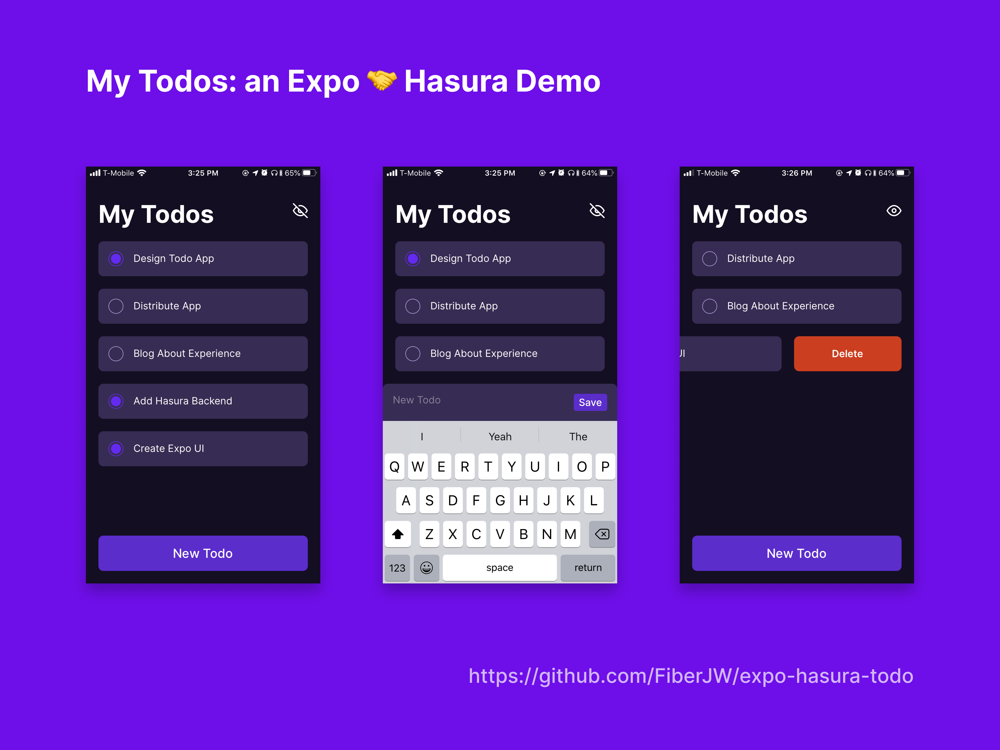

  

<h3 align="center" style="font-weight:600">
  @fiberjw/expo-hasura-todo
</h3>

  A demo showing <a href="https://hasura.io">Hasura</a> being used in an <a href="https://expo.io">Expo</a> app.

---

## Get Started

1. Install [Expo Client](https://expo.io/tools#client)
1. Install [`expo-cli`](https://docs.expo.io/versions/latest/workflow/expo-cli/)
1. Clone this repo
1. `yarn` in the project root
1. `expo start` to run the app development server
1. Open the app in Expo Client on a physical device or simulator
1. Play around with the app, read the code, and keep fueling your passion for learning!

Thanks for checking this out :)
